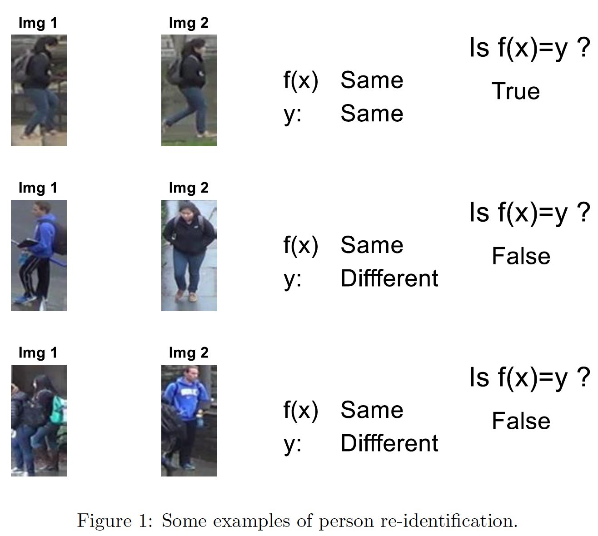

# Person Re-identification

## What is it and how does this work?
Re-ID code written in MATLAB to retrieve two pedestrian images from two different cameras and
compare them to see whether these two images belong to the same person or not. A straightforward way to address this problem is to take the
query image and a putative matching image, and dene a binary classier that reports whether the two
images are the same person (+1, same), or different people (-1, different) as illustrated in (Figure 1). To
train a person re-identier system using this approach, there must be many pairs of person images, some
of which are two images of the same person (+1) and some are two images of two different people (-1).
The task of the project is to implement a person re-identifier. Data for this tasks are in 'person re-id test.mat' and 'person re-id train.mat' respectively (drawn from the [DukeMTMC-reID dataset](https://github.com/layumi/DukeMTMC-reID_evaluation)).

It firstly loads up the image pairs, followed by resizing each image to 128x64, extracting HoG features. In this script, a classier (SVM) is trained to predict the similarity of any pairs of person images (same or different identity) and the accuracy of model is evaluated.

Various approaches have been applied to accomplish this re-id task including **HOG features**, **color histograms** and **deep features extracted by pre-trained AlexNet**.
